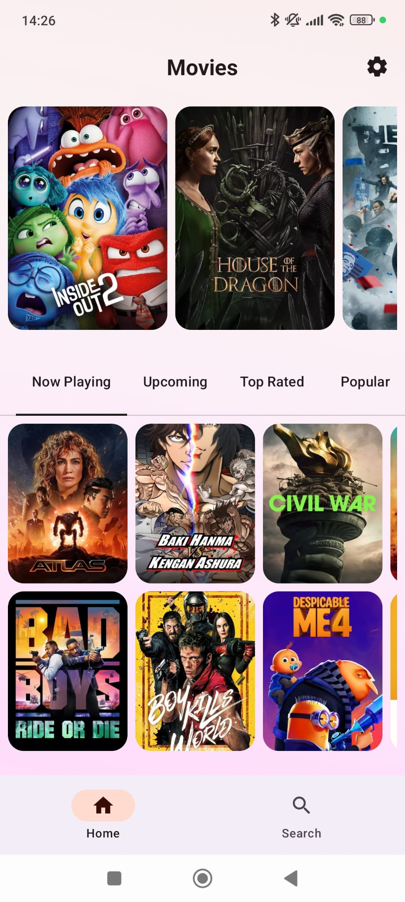
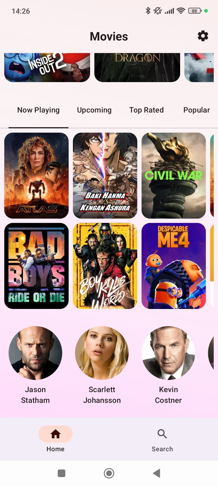
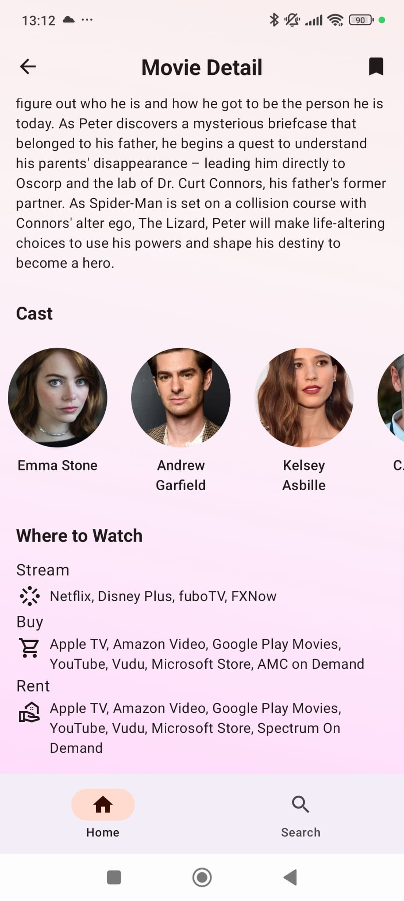
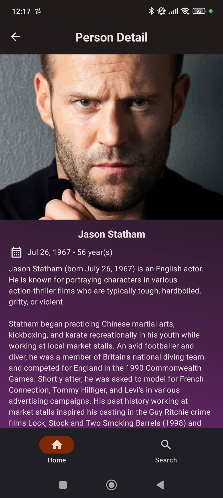
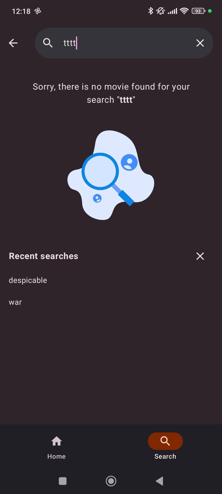
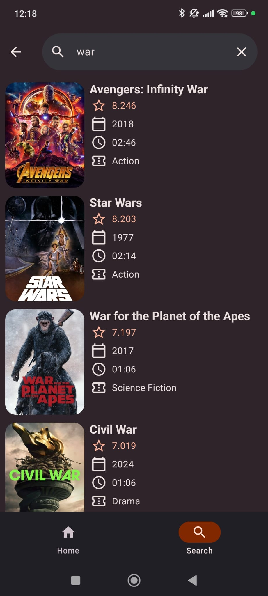
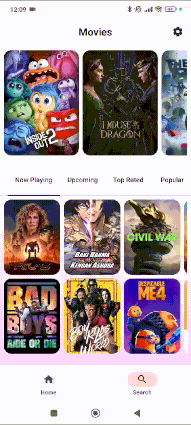

# Movies App

This is a movie / tv series app using [Offline-First](https://developer.android.com/topic/architecture/data-layer/offline-first) / Single-Source Of Truth (SSOT) Architecture with Clean Architecture:
- [JetPack Compose](https://developer.android.com/develop/ui/compose) Android’s recommended modern toolkit for building native UI
- [Compose Navigation](https://developer.android.com/develop/ui/compose/navigation) that is using [Type Safety](https://medium.com/@edmiro/type-safety-in-navigation-compose-23c03e3d74a5)
- [Dagger/Hilt](https://developer.android.com/training/dependency-injection/hilt-android) Dependency injection library
- [Coil](https://coil-kt.github.io/coil/) An image loading library for Android backed by Kotlin Coroutines
- [Detekt](https://github.com/detekt/detekt) A static code analysis tool for Kotlin
- [Ktlint](https://github.com/JLLeitschuh/ktlint-gradle) This plugin creates convenient tasks in your Gradle project that run [ktlint](https://github.com/pinterest/ktlint) checks or do code auto format.
- Flow
- Coroutines
- [Dependency Management with Version Catalog](https://developer.android.com/build/migrate-to-catalogs)
- [Jacoco Plugin](https://docs.gradle.org/current/userguide/jacoco_plugin.html) Generate a coverage report about tests. This [article](https://medium.com/@kurtlemond/migrating-jacoco-reports-gradle-tasks-to-kotlin-dsl-7b566d89ea92) explain the configuration.
- GitHub Actions to build and check test coverage
- [Shared element transition](https://developer.android.com/develop/ui/compose/animation/shared-elements) During transition from list (person or movie) to it details.

## Screenshots and App Animations
<table width="100%">
    <tr>
        <td width="20%"></td>
        <td width="20%"></td>
        <td width="20%"></td>
        <td width="20%"></td>
        <td width="20%"></td>
    </tr>
    <tr>
        <td width="20%"></td>
        <td width="20%"></td>
        <td width="20%"></td>
        <td width="20%"></td>
        <td width="20%"></td>
    </tr>
</table>

<table width="100%">
    <tr style="text-align: center;">
        <td width="50%"></td>
        <td width="50%"></td>
    </tr>
</table>

## Credits
- [Figma Inspiration](https://www.figma.com/design/0UzpDj1nTGKGcFI6uvXgH8/Movies-app-(Community)?node-id=2-657&t=QHzCHMATbRldhTkn-0)
- [Figma Empty State](https://www.figma.com/community/file/931094174831888421)
- [TMDB APIs](https://www.themoviedb.org/) This application uses TMDB and the TMDB APIs but is not endorsed, certified, or otherwise approved by TMDB."
- [Now in Android](https://github.com/android/nowinandroid) GitHub with suggested architecture.

## Nice Error Handling mechanism
Presented by [Philipp Lackner](https://github.com/philipplackner) is this [video](https://www.youtube.com/watch?v=MiLN2vs2Oe0)

Error handling crossing layers, with **Result** interface defined in domain module as following:
```kotlin
sealed interface Result<out D, out E : RootError> {
    data class Success<out D, out E : RootError>(
        val data: D,
    ) : Result<D, E>

    data class Error<out D, out E : RootError>(
        val error: E,
    ) : Result<D, E>

    data class Loading<out D, out E : RootError>(
        val isLoading: Boolean,
    ) : Result<D, E>
}
```

Defining **Error** interface that can be implemented in different layers like:
```kotlin
sealed interface Error
```
 - DataError, NetworkError enum that describes each errors and can be mapped and properly show to the user in presentation layer
```kotlin
sealed interface DataError : Error {
    enum class Network : DataError {
        BAD_REQUEST,
        FORBIDDEN,
        REQUEST_TIMEOUT,
        INTERNAL_SERVER_ERROR,
        SERVICE_UNAVAILABLE,
        NO_INTERNET,
        UNKNOWN,
    }
}
```

In Presentation layer, implement **asUiText** extension function for each new ErrorType and map it to the correct description, according the user language.
```kotlin
fun DataError.asUiText(): UiText =
    when (this) {
        DataError.Network.BAD_REQUEST ->
            UiText.StringResource(
                R.string.data_error_network_bad_request,
            )
        DataError.Network.FORBIDDEN ->
            UiText.StringResource(
                R.string.data_error_network_forbidden,
            )
    }
```

Simplify the error handling in ViewModel
```kotlin
movieDetailsUseCase(movieId, language, countryCode)
  .onEach { result ->
    when (result) {
      is Result.Error -> {
        _movieDetailsState.update {
          AppState(error = result.error.asUiText())
        }
      }

      is Result.Loading -> {
        _movieDetailsState.update { AppState(isLoading = result.isLoading) }
      }

      is Result.Success -> {
        _movieDetailsState.update { AppState(data = result.data) }
      }
    }
  }.launchIn(viewModelScope)
```
